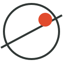
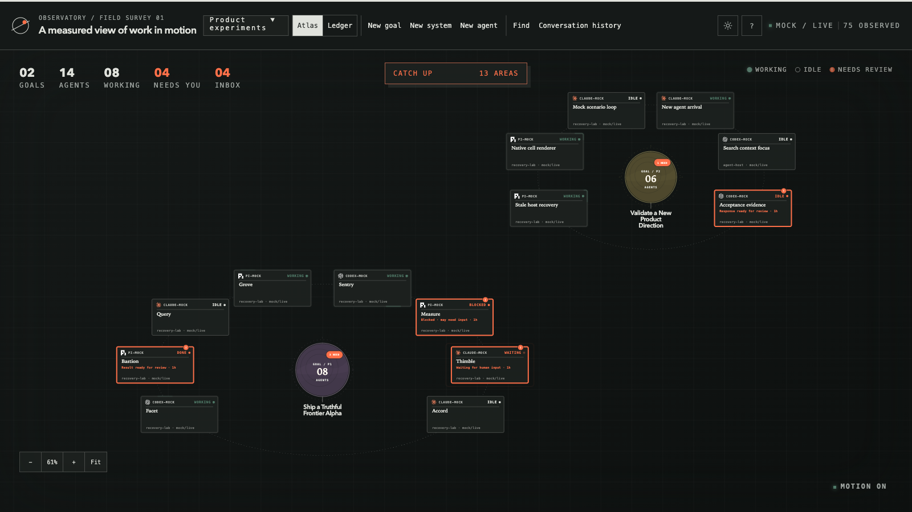

<p align="center">
  
</p>

<h1 align="center">Observatory</h1>

<p align="center">
  <a href="https://github.com/speza/observatory/actions/workflows/ci.yml"></a>
</p>

Observatory is a local, goal-centred GUI for supervising many AI agent
executions across providers, repositories and Git worktrees.

> [!IMPORTANT]
> Observatory is an experimental, early-stage personal project under active
> development. Interfaces and persisted schemas may change without compatibility
> migrations.



It addresses the gap between increasingly autonomous execution and human
supervision. The product should answer five questions quickly:

1. What is the work doing?
2. What changed while I was away?
3. Which result matters?
4. Where is my judgment needed?
5. Can I trust what says it is finished?

The Atlas is useful only when its stable System → Goal → Agent geography makes
those answers easier than reconstructing them from a flat list. Needs you,
Catch up, Ledger, Inbox, inspector, workspace review and hosted terminals are
supporting lenses over the same trusted state.

## Product shape

The maintained product has one client: a local React GUI rendered with native
SVG and CSS. Observatory serves it from the same Bun process that owns the
Universe, SQLite store and selected `SessionHost` adapter.

```text
Browser GUI -> loopback API -> Universe -> SQLite
                              |
                              -> SessionHost -> Herdr
```

The browser never reads SQLite or concrete host protocols. It consumes
projections and submits a narrow set of human commands. Herdr is intentionally
required for the first live product slice, but remains behind the generic
`SessionHost` capability seam. `AO_HOST=mock` exercises the same product path
without a live Herdr installation.

Claude Code, Codex and Pi lifecycle support is supplied by built-in
`agent-harness` plugins. Observatory constructs new and exact-resume plans;
Herdr only places the process and owns its terminal execution. The target
recovery model discovers provider-owned sessions independently from current
Herdr executions. After a laptop or Herdr restart, a confirmed conversation
with no process becomes dormant and can be exactly resumed in a new eligible
Herdr execution. Weak pane or process evidence never inherits its Goal, and a
remote session is not presented as locally portable without provider proof.

The former OpenTUI client was retired on 2026-08-27. It proved the renderer and
host boundaries, but maintaining a second client constrained density, review
workflows and product iteration without strengthening the core hypothesis.
Historical disposable rendering experiments remain under `prototypes/` as
evidence; they are not maintained application code.

## Run

### Prerequisites

- [Bun](https://bun.sh/) 1.3.14 or newer.
- For live agent supervision, [Herdr](https://herdr.dev/docs/) 0.8.2 or newer
  and at least one supported agent harness: Claude Code, Codex or Pi.
- Mock mode requires no Herdr installation, provider login or local agent
  history.

Clone, install and verify:

```sh
git clone https://github.com/speza/observatory.git
cd observatory
bun install --frozen-lockfile
bun run check
bun test
```

Run against the current Herdr host:

```sh
bun run start
```

The default database is `data/ao.sqlite`. Use another path when needed:

```sh
AO_DB_PATH=/private/tmp/observatory.sqlite bun run start
```

The current schema is a clean break and has no compatibility migrations. Back
up and replace an incompatible local database with:

```sh
bun run db:reset:all
```

Open `http://127.0.0.1:4310` after the server starts.

Inspect the redacted local Claude Code and Codex session catalogues without
starting Herdr or writing Observatory state:

```sh
bun run sessions:discover
```

Install the local metadata-only observation hooks and Pi extension with:

```sh
bun run observations:install
```

Check the installed bundles and journal health without modifying them:

```sh
bun run observations:doctor
```

See [Provider observation hooks](docs/guides/provider-observation-hooks.md) for
the retained fields, coexistence and removal boundaries.

Run the deterministic 12-goal, 75-agent development portfolio:

```sh
bun run web:mock
```

It uses `${TMPDIR:-/tmp}/ao-web-mock.sqlite`, synthetic host facts and no real
session content.

Exercise deterministic host loss, degraded host actions and recovery through
the same product path:

```sh
AO_MOCK_SCENARIO=degraded bun run web:mock
```

For frontend development, run these in separate terminals:

```sh
bun run dev:api
bun run dev
```

The Vite client runs on port 4310 and proxies the loopback API on port 4311.

## Current capabilities

- durable human-owned Systems and Goals, with Goal priority, completion and archive;
- stable Goal → Agent assignments and accepted goal positions;
- conversation-first Agent tracking with Herdr represented as an optional runtime;
- one-subject Needs-you decisions composed from blocked, waiting, result and uncertain evidence;
- durable semantic Catch up since the last explicit acknowledgement;
- Atlas and Ledger projections over the same state;
- a narrow Inbox for work awaiting accepted organisation;
- goal editing, agent assignment and host-backed agent launch;
- visible blank-prompt launches with an immediate Observatory terminal until
  the provider creates and identifies the durable conversation;
- provider-independent Claude Code and Codex start/exact-resume plugins;
- automatic Claude Code and Codex admission for exact-live and newly observed
  conversations, exact execution rebinding, dormant/runtime-unknown states and
  searchable Conversation history for older work;
- selected-Agent repository and code-host status through contributed plugins;
- host-synchronised close and archive;
- host-owned primary and linked terminals rendered with xterm.js; and
- bounded, read-only working-tree diff review.

The application is local-only and single-user. It does not ingest transcripts,
own agent processes or PTYs, automatically accept completion, merge work, or
expose the control plane remotely.

## Browser controls

- Click a goal to focus it; click an Agent to select it in its goal context.
- Drag the field to pan and use the wheel or `+`/`-` to zoom.
- `j`/`k` or arrow keys move selection.
- `Enter` focuses a goal or opens the selected Agent terminal.
- `Space`/`f` focuses; `0` resets the camera.
- `a` opens Needs you; `g` jumps to the next decision.
- `v` switches Atlas and Ledger; `b` opens Inbox.
- `n` creates a goal; `N` starts an Agent.
- `i` toggles the inspector; `t` opens the selected terminal.
- `Esc` closes the topmost surface; `?` opens the complete guide.

## Quality commands

```sh
bun run format
bun run format:check
bun run lint
bun run typecheck
bun run check
bun test
bun run build:web
```

Oxfmt owns formatting. Oxlint, the vendored Anti-Slop plugins and TypeScript
check maintained source. Disposable prototypes are excluded deliberately.

## Documentation

- [Documentation index](docs/README.md)
- [Product design](docs/design/agent-orchestration-map.md)
- [Technical architecture](docs/design/technical-architecture.md)
- [Feature roadmap](docs/specs/observatory-feature-roadmap.md)
- [Conversation-first Agent tracking](docs/specs/conversation-first-agent-tracking.md)
- [Plugin contributor guide](docs/guides/plugin-contributor.md)

## Licence

Observatory is licensed under the [MIT License](LICENSE).
